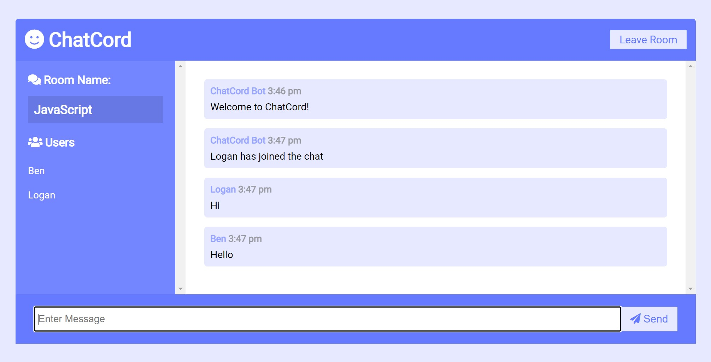

# Chat Cord

A simple chat app built with Socket.io

## Features

- Chat Cord Bot will notify and users in a room if an new user join or left that room
- Many rooms with specific topic discussion about that programming language

## Preview

## To run this project

1. Clone this repository and cd into it
2. Run `npm install`
3. Run `node server.js`
4. Open http://localhost:3000/ in your browser
5. Fill your name and join a room
6. Open another tab in your browser, repeat step 4 and 5 with different name but same room
7. Enjoy, now you can chat to yourself

## Built with

- [Socket.io](https://socket.io/)
- [Express](https://expressjs.com/)
- [Moment.js](https://momentjs.com/)

## Show your support

Give a ⭐️ if you like this project!

## License

[MIT](LICENSE)
